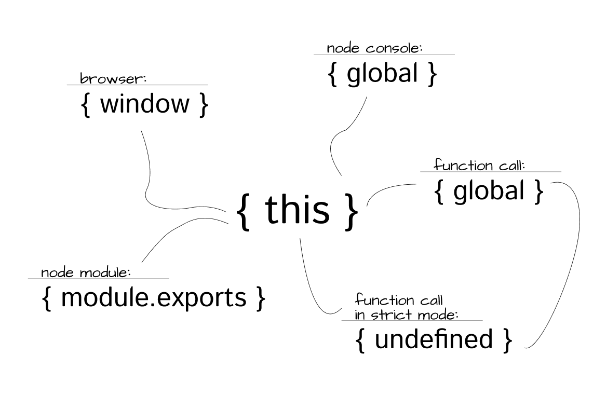

#### This jest trudne this jest złe a TY developerze ogarnij się. Rzecz z ‘this’ ma sie tak, że niewielu z nas je rozumie. Kazdy kto zaczynał programowanie od języków obiektowych, powie, że ‘this’ odnosi się do obcenego obiektu. A tu zonk, bo w JavaScripcie ‘this’ zależy od kontektu wywołania. Szok i nie dowierzanie.

To jak to sie ma właściwie do gwiezdnych wojen? No nijak ale musze wypełnić to jakimś kontentem a nie spoecjalnie chce mi się używać generatorów lorem ipsum. Stąd kolejne akapity staną się zwyczjanie kopy pejstem z jakieś książki.

## Dawno dawno temu w odległej galaktyce

Powiedzmy, że ten artykuł jest bardzo krótki i wogle i już pod tym podsumowującym akapietm będą tagi i takie tam pierdoły. Jkiś szer by się przydał i może cos oboko, okejka czy inny czort. Ah cholera jeszcze komentarze. TO jedziemy.

Od pierwszych dni istnienia internetu język [JavaScript](https://www.google.com) zawsze był podstawową technologią odpowiedzialną za dostarczanie interaktywnej treści użytkowni- kowi. Wprawdzie na początku cechami charakterystycznymi języka JavaScript były na przykład migający kursor myszy lub irytujące wyskakujące okna, ale teraz, niemal dwie dekady później, zarówno technologia, jak i możliwości języka JavaScript zwiększyły się o kilka rzędów wielkości. Już tylko nieliczni wątpią w to, że JavaScript jest sercem najbardziej rozpowszechnionej platformy oprogramowania na świecie — internetu.

## Czym jest this

Od pierwszych dni istnienia internetu język JavaScript zawsze był podstawową technologią odpowiedzialną za dostarczanie interaktywnej treści użytkowni- kowi. Wprawdzie na początku cechami charakterystycznymi języka JavaScript były na przykład migający kursor myszy lub irytujące wyskakujące okna, ale teraz, niemal dwie dekady później, zarówno technologia, jak i możliwości języka JavaScript zwiększyły się o kilka rzędów wielkości. Już tylko nieliczni wątpią w to, że JavaScript jest sercem najbardziej rozpowszechnionej platformy oprogramowania na świecie — internetu.

Istnieje tendencja, aby zaawansowane koncepcje głęboko zakorzenione w ję- zyku wyrażać w pozornie prosty sposób. Przykładem może być tutaj prze- kazywanie funkcji w postaci wywołań zwrotnych. To zachęca programistów JavaScript do użycia języka w istniejącej postaci i nieprzejmowania się tym, co dzieje się „pod maską”.

## Podsumowanie

Na tym polega paradoks języka JavaScript — to jego pięta Achillesa i zarazem wyzwanie, któremu próbujemy sprostać. Ponieważ JavaScript może być uży- wany bez większej wiedzy na jego temat, programiści często nie starają się jej posiąść.
