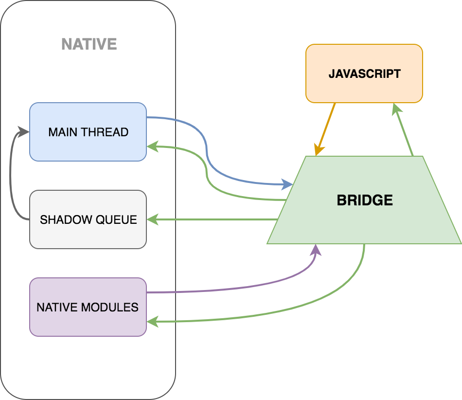
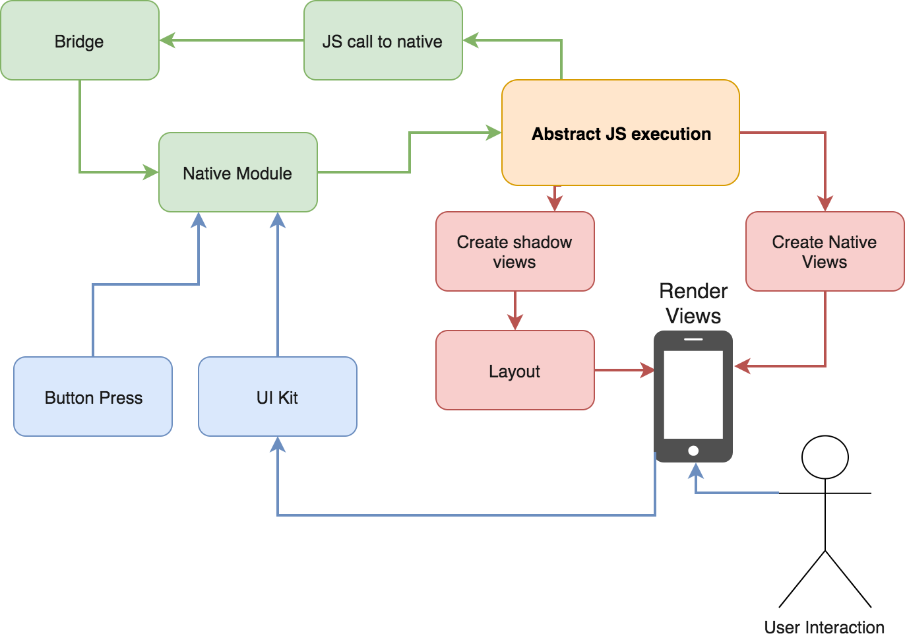

#### Ten artykuł jest poniekąd pochodną prezentacji, którą prowadziłem podczas [Mobile Białystok#16](https://www.facebook.com/mobilebialystok/videos/1912960945444174/). Nie będzie to transkrypt prelekcji, ale raczej usystematyzowanie zaprezentowanych tam informacji. Zacznijmy więc od początku.

## Czym jest React Native
React Native jest frameworkiem przygotowanym przez zespół Facebook pozwalającym tworzyć aplikacje mobilne wykorzystując JavaScript oraz React. Więcej o historii jego powstania oraz motywacji można przeczytać w moim poprzednim [poście](https://deviously.pl/react-native-history/).

React to biblioteka odpowiadająca za generowanie UI. Jednym z jej kluczowych aspektów jest to, że nie operuje bezpośrednio na realnym drzewie DOM. Zamiast tego w pamięci tworzona jest jego kopia. Za każdym razem kiedy aplikacja zmienia stan efekt takiej akcji jest dodawany do obiektu w pamięci. Następnie zostaje on porównany z drzewem DOM. Jeśli istnieje konieczność zmiany w warstwie wizualnej danej gałęzi, następuje jej przeładowanie. Ten mechanizm nazywany jest VirtualDOM.
Poza tym React wprowadza szereg funkcji oraz rozwiązań pozwalających pisać czytelny kod, jednak to mechanizm VirtualDOM jest kluczowy w zrozumieniu działania React Native.

## Architektura aplikacji React Native
Skoro już wiemy co napędza wizualną część React Native i odpowiada za jego składnię, pora zajrzeć pod maskę i zrozumieć jak działa sam framework.
Każdą aplikację React Native możemy podzielić na trzy części:
- natywną
- Java Script
- most (Bridge)



W części natywnej aplikacja uruchamia kilka wątków, z czego główny *Main Thread* odpowiada za jej stan, działanie w tle itp. Każdy natywny moduł wykorzystany w aplikacji posiada swój własny wątek. *Shadow Queue* jest zbiorem informacji o layout oraz shadow nodes.
"Po drugiej stronie" mostu znajduje się pojedynczy wątek JavaScript. Jest to w dużym uproszczeniu maszyna witrualna, w której wykonuje się cały skrypt.
Pomiędzy nimi jest most, który odpowiada za komunikację między JS runtime a Native Modules.
Łatwe czyż nie?

## Uruchomienie aplikacji
Nie będe tu pokazywał ‘get-started’ dla React Native, po takie poradniki odsyłam do [dokumentacji](https://facebook.github.io/react-native/docs/getting-started.html). Zacznijmy od tego co się dzieje kiedy uruchamiamy aplikację. Jak łatwo się domyślić na początku uruchamiana jest maszyna wirtualna JavaScriptu. Ponadto na tym samym etapie do pamięci ładowane są natywne moduły oraz  generowany jest bundle js, czyli całość kodu JS, scalona do jednego pliku tekstowego. Posiadając te dane silnik napędzający React Native tworzy plik konfiguracyjny JSON, w którym znajdują się wszystkie informacje dotyczące wykorzystanych natywnych modułów w aplikacji. Przykładowy plik może wyglądać podobnie do tego uproszczonego przykładu:
```json
 {
   remoteModuleConfig: [
   // [ $moduleName, $exportedConsts: {}, $methods: []?, $asyncIndexes: []? ]
     [ "RCTAlertManager", [ "AlertWithArgs" ] ],
   ]
 }
```
Mając przygotowaną konfigurację aplikacji silnik przechodzi do wykonywania kodu w maszynie wirtualnej. Zanim jednak omówię cykl życia aplikacji, chciałbym pokrótce przedstawić działanie silnika JS.

## JavaScript engine
Każdy  język musi zostać przekompilowany do notacji rozumianej przez komputer, czyli kodu maszynowego. Kod JS, który piszemy jest abstrakcyjny i dzieli go bardzo daleka droga do kodu maszynowego. Stąd mimo twierdzenia, że ten język nie jest kompilowany to trzeba pamiętać, że gdzieś następuje jego transpilacja, kompilacja i wykonanie. Te gdzieś to właśnie maszyna wirtualna środowiska JS.
Pierwszym krokiem jaki wykonuje VM jest skopiowanie bundle JS za każdym razem kiedy zostanie zmieniony. Następnie maszyna parsuje kod oraz rozmieszcza poszczególne elementy programu w drzewie składniowym. Na tej podstawie silnik generuje kod bajtowy. I te etapy są bardzo pracochłonne, stąd istnieje potrzeba ich optymalizacji.

Wróćmy więc do kopiowania bundle. Zanim jeszcze plik js zostanie poddany parsowaniu, następuje sprawdzenie, które elementy rzeczywiście muszą zostać wygenerowane w tym momencie. Wszystkie pozostałe funkcje, komponenty, klasy etc. zostają przepuszczone przez *syntax checking*. Jeśli nie ma błędów składniowych JS niezbędny kod bajtowy zostaje wykonany i maszyna JS zaczyna cykl od początku.

## Aplikacja w akcji!

Działanie aplikacji rozpoczyna się od wyrenderowania widoków. Tu do akcji wkracza mechanizm znany z React, odpowiednik VirtualDOM. Z jednej strony następuje wyrenderowanie gotowych widoków użytkownikowi - DOM, a w tle przechowywany jest obiekt, na którym przeprowadzane są wszystkie zmiany w UI. Dodtkowo nastepuje tu przygotowanie Layoutu aplikacji, czyli wartości znanych z css do natywnych właściwości obiektów wizualnych.



Następnie aplikacja oczekuje na akcję wykonaną przez użytkownika, bądź jeden z komponentów np. doładowanie danych. To wyołuję kolejny łańcuch reakcji, który rozpoczyna się od sprawdzenia w module natywnym czy wymagana jest reakcja w części JavaScriptowej. Dobrym przykładem działania bez jej wykorzystania jest wyświetlenie natywnego AlertIOS z treścią błędu systemowego. Jesli natomiast komponent natywny nie posiada logiki niezbędnej do zareagowania na otrzymaną akcję nastepuje odwołanie do silnika JS. Tam kod jest przetwarzany i jesli wymagna jest zmiana działania modułu bądź jego wyglądu informacje o tym transferowane sa przez most.

Most (Bridge) jest głównym elementem aplikacji React Native. Można by poświęcic temu oddzielny artykuł, teraz jednak przedstawie po krótce jego działanie. Ten element łączy kod natywny z JavaScript bundle. Każda akcja, dane czy też polecenia są tędy przesyłane i tak, to jest wąskie gardło całego procesu. Jeśli przez most dane byłyby przesyłane synchronicznie, to możnaby było wykonać jedną akcję jednocześnie, blokując przy tym działanie aplikacji. Co za tym idzie bridge wykorzystuje asynchroniczność do przesyłania danych.
Dzięki temu możemy przesyłać dużą ilość danych, co za tym idzie most znów się zapycha. Koniecznie jest łączenie przesyłanych danych w większe paczki. Dzięki temu możemy przesłać dużo w krótkim czasie, ale… Nie możemy od tak spakować danych i ich przesłać. Najpierw należy je zserializować. Po drugiej tronie mostu dane muszą zotać przetłumaczone ponownie. Tak w dużym skrócie działa ten mechanizm. Po więcej zapraszam do obejrzenia tego [filmu](https://youtu.be/GiUo88TGebs), są tu również informację o tym jak można podglądać dane przechodzące przez most co daje duże pole do optymalizacji działania aplikacji.
Skoro dane przebyły doroge przez most, JS bundle skomunikował się z natywnymi wątkami aplikacji czas na powrót do maszyny wirtualnej JS gdzie sprawdzane jest czy wykonanie zmian w widoku użytkownika jest konieczne. I wtedy użytkownik naciska przycisk jeszcze raz…

## Podsumowanie
React Native pozwala tworzyć aplikację natywne, ale serduchem każdej z nich nadal jest JavaScript. Czy to dobrze czy źle, nie wiem. Mimo wielowątkowśic aplikacji, wąskim gardłem pozostaje sam proces przesyłania danych między dwoma różnymi środowiskami.
Pamiętajmy, że to co tu przedstawiłem jest tylko wierzchołkiem góry lodowej, jaką jest cały silnik odpowiadający za działanie React Native. Obecnie ta technologia jest bardzo obiecująca, jak będzie dalej czas pokaże. Jako deweloperzy nadal borykamy się z problemami w obsłudze natywnych modułów w Androidzie. Z każda zmianą w API React trzeba się liczyc, że aplikacja React Native moze zachować się nieoczekiwanie, ale to nadal beta.
W trakcie pisania tego blogposta React Native był dostępny w wersji 0.53


